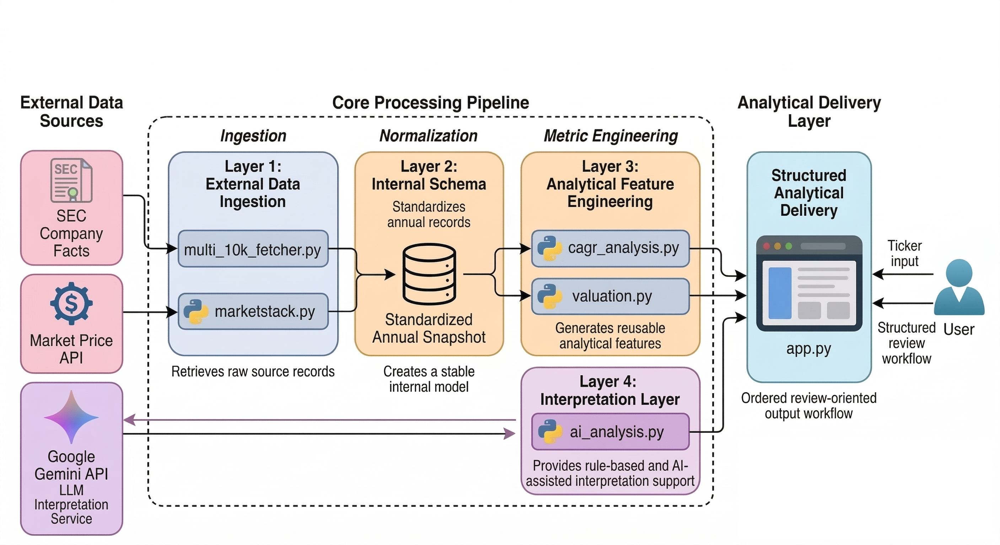

# External Data Pipeline and Analytical Delivery App

A modular Python project that retrieves external public data, restructures heterogeneous source records into a standardized internal schema, engineers reusable analytical metrics, and delivers the results through a structured Streamlit workflow.

  

  <em>Figure 1. End-to-end workflow for external financial source data (10K).</em>

## Overview

This project was developed as an end-to-end data workflow built on external financial source data.  
The primary objective was not domain-specific financial commentary, but the design of a reusable analytical pipeline that can:

- ingest raw data from multiple external sources
- standardize semi-structured records into a stable internal model
- transform normalized records into derived analytical features
- deliver outputs through an ordered application interface
- support downstream interpretation through rule-based and AI-assisted layers

Although the input domain is financial data, the technical focus of the project is data ingestion, schema design, transformation logic, modular workflow construction, and analytical output delivery.

## Problem Framing

External source data is often difficult to use directly in repeated analytical workflows.  
Raw records may be fragmented across sources, inconsistent in structure, and not immediately suitable for comparison, metric computation, or review-oriented presentation.

This project addresses that problem by building a workflow that separates the pipeline into distinct layers:

**External Retrieval → Internal Schema → Metric Engineering → Application Delivery → Interpretation Layer**

This structure was designed so that source-specific complexity remains isolated from downstream analysis and presentation logic.

## Core Workflow

### 1. External Retrieval
The pipeline retrieves data from public external sources and collects raw records needed for analysis.

### 2. Internal Schema
Retrieved source values are reorganized into standardized annual `FinancialSnapshot` records so that later processing does not depend directly on raw source responses.

### 3. Metric Engineering
The pipeline computes reusable analytical features from normalized records, including:

- growth metrics
- profitability metrics
- cash flow quality metrics
- financial condition metrics
- valuation-related metrics

### 4. Application Delivery
Outputs are presented through a Streamlit application in a structured order rather than as a flat metric dump.

### 5. Interpretation Layer
Rule-based signals and AI-assisted summaries are added on top of structured quantitative outputs to support faster review and interpretation.

## Technical Focus

This project emphasizes the following technical capabilities:

- external data ingestion from public sources
- schema design for semi-structured records
- reusable transformation logic built on normalized data
- modular metric computation across separate components
- structured output delivery through an application interface
- interpretation support layered on top of processed analytical results

## Why This Structure Matters

The main value of the project lies in the way raw external data is converted into a repeatable analytical workflow.

This structure supports:

- clearer separation between source retrieval and downstream logic
- easier extension of the pipeline to additional metrics or output layers
- more consistent review of multi-year records
- better reuse of the same workflow across different input domains with similar structural problems

For that reason, the project is best understood as a data pipeline and analytical delivery system rather than as a finance-only application.

## Project Structure

    .
    ├── app.py
    ├── ai_analysis.py
    ├── cagr_analysis.py
    ├── marketstack.py
    ├── multi_10k_fetcher.py
    ├── valuation.py
    └── notebooks/

## Module Roles

- **`multi_10k_fetcher.py`**  
  Handles external retrieval from SEC company facts, ticker mapping, and annual snapshot construction.

- **`marketstack.py`**  
  Retrieves market price context used in later analytical steps.

- **`cagr_analysis.py`**  
  Computes growth, profitability, cash flow quality, and financial condition metrics from standardized annual records.

- **`valuation.py`**  
  Computes per-share and valuation-related outputs from the latest normalized snapshot.

- **`ai_analysis.py`**  
  Converts structured analytical outputs into interpretation-ready prompts and generates AI-assisted summaries.

- **`app.py`**  
  Integrates the full workflow into a Streamlit-based analytical interface.

## What This Project Demonstrates

This repository demonstrates the ability to:

- build a modular workflow on top of external data sources
- convert raw source records into a stable internal schema
- design reusable metric logic from normalized records
- organize analytical outputs into a review-friendly interface
- connect structured quantitative processing to higher-level interpretation

These capabilities are directly relevant to data-focused roles that require data integration, transformation, workflow design, and application-layer delivery.

## Validation Perspective

One of the main lessons from this project was that clean outputs do not automatically guarantee trustworthy meaning.

Key analytical considerations include:

- alignment of retrieved records across years
- reliability of source-to-schema field mapping
- comparability of records across time
- careful interpretation of incomplete or ambiguous source values

This perspective influenced both the project structure and the documented improvement directions.

## Tech Stack

- Python
- Pandas
- Streamlit
- Requests

## Run

    streamlit run app.py
